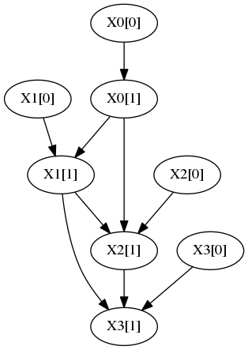

## learn_cDBN

learn_cDBN is a Java implementation of a learning algorithm for **consistent k-graph dynamic Bayesian networks**(cDBN). The program receives a data set with multivariate longitudinal categorical observations and outputs the optimal structure. The algorithm has polynomial time complexity in the number of attributes and observations. 

If you use learn_cDBN in your research please cite:

José L Monteiro, Susana Vinga, and Alexandra M Carvalho. [Polynomial-time algorithm for learning
optimal tree-augmented dynamic Bayesian networks.](http://auai.org/uai2015/proceedings/papers/329.pdf) In UAI, pages 622–631, 2015.

## Usage

In [tDBN](http://josemonteiro.github.io/tDBN/) the input file format is described.

By executing the following .jar file:
```
$ java -jar learn_cDBN.jar

```

The command line options are:
```


 -c,--compact                 Outputs network in compact format, omitting
                              intra-slice edges. Only works if specified
                              together with -d and with --markovLag 1.
 -d,--dotFormat               Outputs network in dot format, allowing
                              direct redirection into Graphviz to
                              visualize the graph.
 -i,--inputFile <file>        Input CSV file to be used for network
                              learning.
 -m,--markovLag <int>         Maximum Markov lag to be considered, which
                              is the longest distance between connected
                              time-slices. Default is 1, allowing edges
                              from one preceding slice.
 -ns,--nonStationary          Learns a non-stationary network (one
                              transition network per time transition). By
                              default, a stationary DBN is learnt.
 -o,--outputFile <file>       Writes output to <file>. If not supplied,
                              output is written to terminal.
 -p,--numParents <int>        Maximum number of parents from preceding
                              time-slice(s).
 -pm,--parameters             Learns and outputs the network parameters.
 -r,--root <int>              Root node of the intra-slice tree. By
                              default, root is arbitrary.
 -s,--scoringFunction <arg>   Scoring function to be used, either MDL or
                              LL. MDL is used by default.                              
 -ckg,---ckg                 learns cDBN structures.
                              
 -ind,---intra_ind            In-degree of the intra-slice transition 
                              network.
                                                       
```
## Example

Consider the data set [cDBN1_5000.csv](cDBN1_5000.csv). The following command:

```
java -jar cDBN.jar -i cDBN1_5000.csv -p 1 -s mdl -ckg -ind 2 -o output_new -d 

```

Produces the follwing structure:



## learn_bcDBN

Is an update of learn_cDBN, that learns **BFS-consistent k-graph dynamic Bayesian networks**(bcDBN). The input file format and command line options are the same as the described for learn_cDBN.


